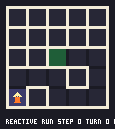
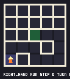
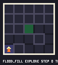
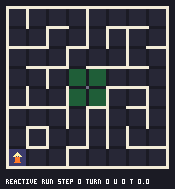
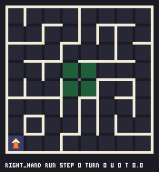
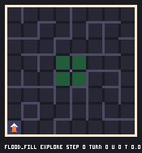
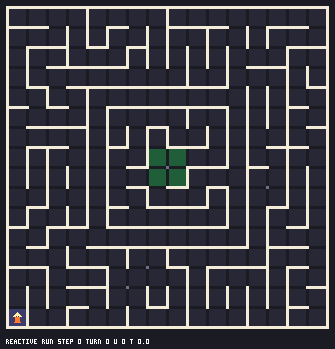
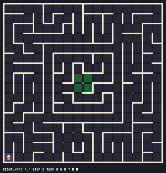
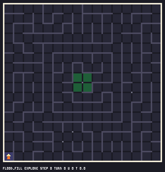

# Симулятор Micromouse

Клеточный симулятор робота из `Core/Src/main.c` (три бинарных ИК-датчика, моторы без энкодеров) и сравнение трёх стратегий на случайных лабиринтах. Только стандартная библиотека Python 3.

| стратегия | что делает | нужна карта |
|---|---|---|
| `reactive` | логика прошивки: впереди свободно — вперёд; иначе влево, если свободно только слева; иначе вправо; тупик — разворот | нет |
| `right_hand` | правило правой руки: направо, иначе прямо, иначе налево, иначе разворот | нет |
| `flood_fill` | карта известных стен + BFS-расстояния до цели; фазы разведка → возврат → скоростной заезд | да |

## Запуск

Из корня репозитория:

```bash
python -m sim bench --n 500 --size 16 --seed 1     # серия лабиринтов → results/bench.csv, bench.md
python -m sim viz --maze sim/mazes/island16.txt --strategy flood_fill --out out.gif
python -m unittest discover -s tests -t .          # 41 тест
```

Ключи: `--noise p` — вероятность ложного показания датчика, `--size`/`--loops` — случайный лабиринт, `--maze` — файл из `sim/mazes/`. Ещё есть `show` (ASCII-трасса в терминал) и `gen` (лабиринт в файл).

## Метрики

Лабиринт N×N, старт в углу, цель — центр 2×2, лимит 4·N² шагов. Время модельное: клетка 1.0, поворот 0.5, разворот 1.0, удар в стену 0.5.

- **решено** — доля лабиринтов, где робот дошёл до цели в пределах лимита;
- **шаги / повороты / развороты / время** — до первого попадания в цель, только по решённым прогонам;
- **заезд / оптимум** — длина скоростного заезда flood fill к кратчайшему пути по полному лабиринту (BFS).

## Результаты

500 лабиринтов, seed 1, циклов = N. Полная таблица — `results/bench.md`.

### 16×16

| шум | стратегия | решено | шаги: медиана | среднее | p90 | повороты | развороты | удары | время | заезд / оптимум |
|---|---|---:|---:|---:|---:|---:|---:|---:|---:|---:|
| 0 | reactive | 25.6 % | 39 | 44.5 | 80 | 23.3 | 1.0 | 0.0 | 57.1 | — |
| 0 | right_hand | 57.4 % | 98 | 114.5 | 218 | 62.8 | 5.5 | 0.0 | 151.5 | — |
| 0 | flood_fill | 100.0 % | 40 | 48.3 | 89 | 27.7 | 1.0 | 0.0 | 63.2 | 1.000 (30.9 / 30.9) |
| 0.05 | reactive | 63.4 % | 156 | 272.2 | 704 | 131.4 | 25.8 | 7.7 | 367.6 | — |
| 0.05 | right_hand | 94.6 % | 222 | 303.2 | 682 | 213.4 | 23.9 | 4.7 | 436.1 | — |
| 0.05 | flood_fill | 100.0 % | 54 | 65.2 | 124 | 47.9 | 3.6 | 8.2 | 96.8 | 1.085 (33.5 / 30.9) |

### 8×8

| шум | стратегия | решено | шаги: медиана | среднее | p90 | повороты | развороты | удары | время | заезд / оптимум |
|---|---|---:|---:|---:|---:|---:|---:|---:|---:|---:|
| 0 | reactive | 51.8 % | 13 | 17.2 | 35 | 7.8 | 0.4 | 0.0 | 21.5 | — |
| 0 | right_hand | 69.4 % | 23 | 27.5 | 55 | 14.2 | 1.2 | 0.0 | 35.8 | — |
| 0 | flood_fill | 100.0 % | 9 | 11.4 | 21 | 6.2 | 0.1 | 0.0 | 14.7 | 1.000 (8.8 / 8.8) |
| 0.05 | reactive | 86.4 % | 29 | 53.3 | 135 | 23.8 | 4.3 | 1.4 | 70.2 | — |
| 0.05 | right_hand | 98.2 % | 37 | 50.3 | 115 | 34.7 | 3.8 | 0.7 | 71.8 | — |
| 0.05 | flood_fill | 100.0 % | 10 | 13.3 | 24 | 8.6 | 0.5 | 0.7 | 18.4 | 1.028 (9.1 / 8.8) |

Reactive не сворачивает в боковой проход, пока впереди свободно, поэтому на кольце коридоров зацикливается. Правая рука обходит все тупики и не попадает на «остров» — часть лабиринта, не связанную с внешней стеной. Шум датчиков выбивает обе из цикла (решённых больше), но ценой в разы большего числа шагов.

## Контрпримеры (`sim/mazes/`)

`loop8.txt` — кольцо в стартовом углу: reactive кружит вечно, right_hand — 6 шагов, flood_fill — 8 шагов и заезд 6.
`island16.txt` — цель на острове внутри кольцевого коридора: reactive и right_hand не решают, flood_fill — 28 шагов, заезд равен оптимуму.

## Анимации (`results/viz/`)

Синий — разведка, фиолетовый — возврат, жёлтый — скоростной заезд, зелёный — цель. У flood fill известные роботу стены нарисованы ярко, остальные тускло; цифры в клетках — расстояние до цели по карте робота.

| | reactive | right_hand | flood_fill |
|---|---|---|---|
| corridor5 |  |  |  |
| loop8 |  |  |  |
| island16 |  |  |  |

## Структура

```
maze.py        лабиринт, BFS, генератор, текстовый формат
robot.py       поза, датчики, действия, шум
strategies.py  reactive / right_hand / flood_fill
simulate.py    цикл прогона
bench.py       серия лабиринтов, CSV/Markdown
viz.py         PNG, GIF, ASCII
mazes/         corridor5, loop8, island16, random16
results/       bench.csv, bench.md, viz/
```

## Ограничения

- Поза робота известна точно: ошибки одометрии не моделируются, шум только у датчиков.
- Датчики бинарные (стена / нет), как на роботе; расстояние не измеряется.
- Время модельное: движение дискретное, без разгона и торможения.
